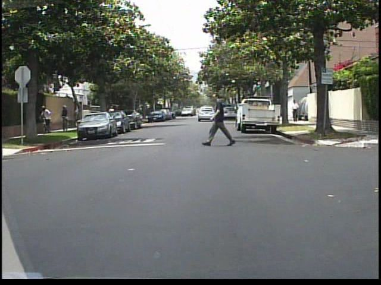
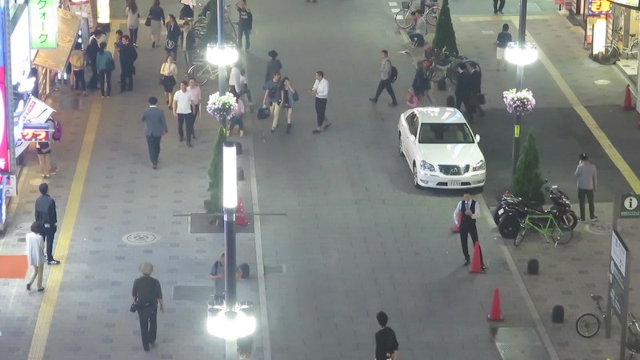
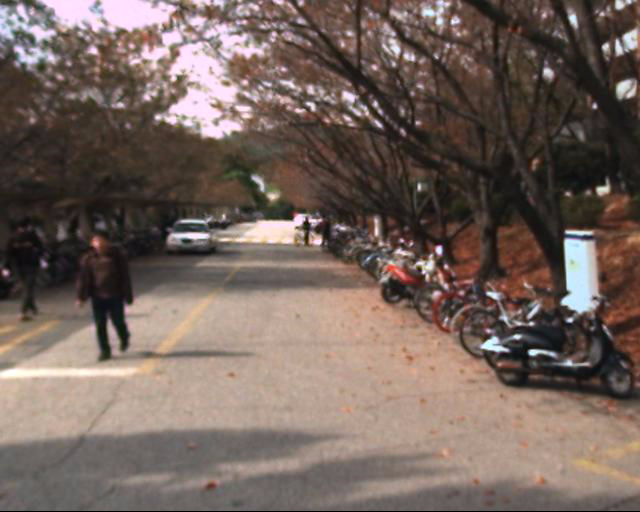

# Evaluation

The main purpose is to select only single person labels in particular 
datasets and count important images and objecs.

# Kitti Dataset
Among lot of various road environment datasets there are two which are useful    for our problem:
* [Dataset for detection](http://www.cvlibs.net/datasets/kitti/eval_object.php?obj_benchmark=2d) 
with 8 classes (Car, Van, Truck, Pedestrian, Person_sitting, Cyclist, Tram, Misc).
* [Dataset for object tracking](http://www.cvlibs.net/datasets/kitti/eval_tracking.php) with the same 8 classes. 

It provides several pictures with corresponding labels files to train the network and many other pictures to test the training (see folder `detection).

## Labels description:

| Position | Name | Description |
|:------:|:-----:|:----------|
| 0 | type | Describes the type of object: 'Car', 'Van', 'Truck', 'Pedestrian', 'Person_sitting', 'Cyclist', 'Tram', 'Misc' or 'DontCare'|
| 1 | truncated | Float from 0 (non-truncated) to 1 (truncated), where truncated refers to the object leaving image boundaries |
| 2 | Occulted | Integer (0,1,2,3) indicating occlusion state: 0 = fully visible, 1 = partly occluded 2 = largely occluded, 3 = unknown |
| 3 | alpha | Observation angle of object, ranging [-pi..pi] |
| 4-7 | bbox | 2D bounding box of object in the image (0-based index): contains left, top, right, bottom pixel coordinates | 
| 8-10 | dimentions | 3D object dimensions: height, width, length (in meters) |
| 11-13 | location | 3D object location x,y,z in camera coordinates (in meters) |
| 14 | rotation_y | Rotation ry around Y-axis in camera coordinates [-pi..pi] |
| 15 | score | Only for results: Float, indicating confidence in detection, needed for p/r curves, higher is better. |

## Evaluation results
Total number of pictures:  7481  
Total number of pedestrians:  4487  
Total number of pictures with pedestrians:  1779  
Total number of pictures without pedestrians:  5702  
Average of pedestrians per picture with pedestrians:  2.52  
Average of pedestrians per picture in general:  0.59

# Caltech Pedestrian Dataset

Dataset was created for the problem of pedestrian detection. 
It contains objects of three classes: "person" for single person, 
"people" for group of persons, and "person?" for ambiguous cases. 

Labeling is done in a very strange format usign MATLAB data structures
and saved as ".vbb" files.  
Data is presented as video files of ".seq" format so it's necessary to cut
this videos in separate images.

## Selecting proper images
We would like to exclude images which contain bounding boxes for "people"
and "person?" classes to have data exactly for our problem. So resulting 
dataset should contain images only with "person" instances, and images 
without any of above classes.

## Cutting videos to frames
Cutting could be done using solution from this
[Github repository](https://github.com/jainanshul/caltech-pedestrian-dataset-extractor).

It requires to install some packages:  
`$ sudo apt install nodejs-legacy npm`  
and then to install requirements (run command from repo folder):  
`$ npm install`

Finally run the script for frame cutting (it is assumed that there is folder 
`data/` with unpacked dataset in the same directory):  
`$ node caltech_pd.js`

## Evaluation results
Total number of pictures:  208542  
Total number of pedestrians:  185884  
Total number of pictures with pedestrians:  89482  
Total number of pictures without pedestrians:  119060  
Average of pedestrians per picture with pedestrians:  2.07  
Average of pedestrians per picture in general:  0.89

# MOT17 Dataset
The main interest of the authors of the dataset is to track moving objects in videos. In particular, they are interested in multiple people tracking algorithms, therefore, people will be the center of attention.
They provide a set of 600 pictures with a labels file.
A detailed description of dataset and relative benchmarks can be found [here](https://arxiv.org/pdf/1603.00831.pdf).

Mot provides pictures divided in blocks which represent different scenes. We have decided to use only blocks in which pedestrian are as spaced as possible in order to avoid ambiguities in the training phase of the network. For this purpose the best block is `MOT-09.

## Labels description:
Detection and annotation files are simple comma-separated value (CSV) files. Each line represents one object instance and contains 9 values as shown in the following table.

| Position | Name | Description |
|:------:|:-----:|:----------|
| 0 | Frame number | Indicate at which frame the object is present |
| 1 | Identity number | Each pedestrian trajectory is identified by a unique ID (−1 for detections) |
| 2 | Bounding box left | Coordinate x of the top-left corner of the pedestrian bounding box |
| 3 | Bounding box top | Coordinate y of the top-left corner of the pedestrian bounding box |
| 4 | Bounding box width | Width in pixels of the pedestrian bounding box | 
| 5 | Bounding box height | Height in pixels of the pedestrian bounding box |
| 6 | Confidence score | It acts as a flag whether the entry is to be considered (1) or ignored (0). |
| 7 | Class | Indicates the type of object annotated |
| 8 | Visibility | Visibility ratio, a number between 0 and 1 that says how much of that object is visible. Can be due to occlusion and due to image border cropping. |

Classes of detected objects and their corresponding values:

| ID | Class |
|:-----:|:------:|
| 1 | Pedestrian |
| 2 | Person on vehicle|
| 3 | Car |
| 4 | Bicycle |
| 5 | Motorcycle |
| 6 | Non motorized vehicle |
| 7 | Static person |
| 8 | Distractor |
| 9 | Occluder |
| 10 | Occluder on the ground |
| 11 | Occluder full |
| 12 | Reflection |

If a person is cropped by the image border, the box is estimated beyond the original frame to represent the entire person and to estimate the level of cropping.
As you can see, the dataset also distinguishes people inside vehicles.
For our purpose we decided to drop pictures with people inside vehicles to not create ambiguities in the neural network training and we cropped bounding boxes which were not completely included in the picture.

## Evaluation results

Here are reported only evaluation results relative to MOT-09 block of pictures.

Total number of pictures: 525  
Total number of pedestrians: 5325  
Total number of pictures with pedestrians: 525  
Total number of pictures without pedestrians: 0  
Average of pedestrians per picture with pedestrians: 10.14  
Average of pedestrians per picture in general:  10.14

# Kaist dataset

The dataset was created for pedestrian detection, in fact it uses the standard provided by caltech for the architecture of the project and for label files.

> Most existing datasets focus on a color channel, while a thermal channel is helpful for detection even in a dark environment. With this in mind, Kaist proposes a multispectral pedestrian dataset which provides well aligned color-thermal image pairs, captured by beam splitter-based special hardware. The color-thermal dataset is as large as previous color-based datasets and provides dense annotations including temporal correspondences.

## Labels description
Each label file has the same name of the relative picture with different extension and provides a first line with `% bbGt version=3` string and then (if exist) a line for each object recognised in the picture as follows:

| Position | Name | Description |
|:------:|:-----:|:----------|
| 0 | Class | Indicate at which frame the object is present |
| 1 | Bounding box left | Each pedestrian trajectory is identified by a unique ID (−1 for detections) |
| 2 | Bounding box right | Coordinate x of the top-left corner of the pedestrian bounding box |
| 3 | Bounding box width | Width in pixels of the pedestrian bounding box | 
| 4 | Bounding box height | Height in pixels of the pedestrian bounding box |
| 5 | Non relevant | This value is not relevant for our analysis |
| 6 | Non relevant | This value is not relevant for our analysis |
| 7 | Non relevant | This value is not relevant for our analysis |
| 8 | Non relevant | This value is not relevant for our analysis |
| 9 | Non relevant | This value is not relevant for our analysis |
| 10 | Non relevant | This value is not relevant for our analysis |
| 11 | Non relevant | This value is not relevant for our analysis |

##Evaluation results

Total number of pictures:  95324  
Total number of pedestrians:  86152  
Total number of pictures with pedestrians:  37742  
Total number of pictures without pedestrians:  57582  
Average of pedestrians per picture with pedestrians:  2.28  
Average of pedestrians per picture in general:  0.90  